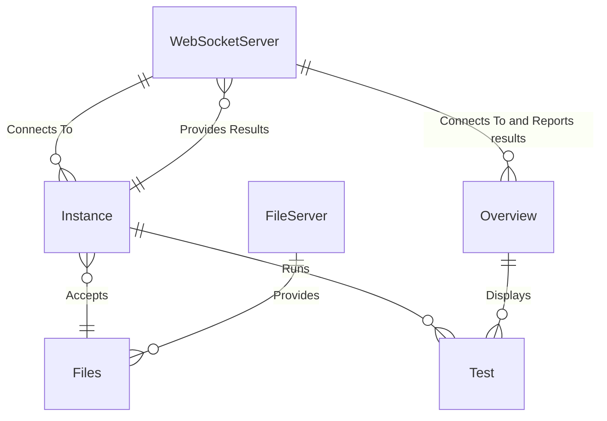

# Structure

```mermaid
erDiagram
	WebSocketServer ||--o{ Instance : "Connects To"
	Instance }o--|| Files : Accepts
	FileServer ||--o{ Files : Provides
	Instance ||--o{ Test : Runs
	Instance ||--o{ WebSocketServer : "Provides Results"
	WebSocketServer ||--o{ Overview : "Connects To and Reports results"
	Overview ||--o{ Test : "Displays"
```